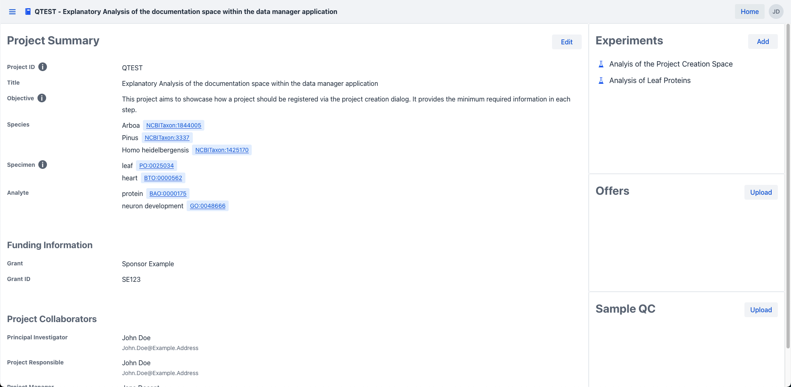
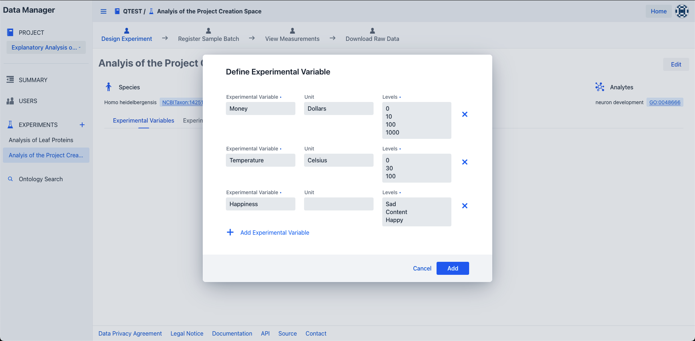
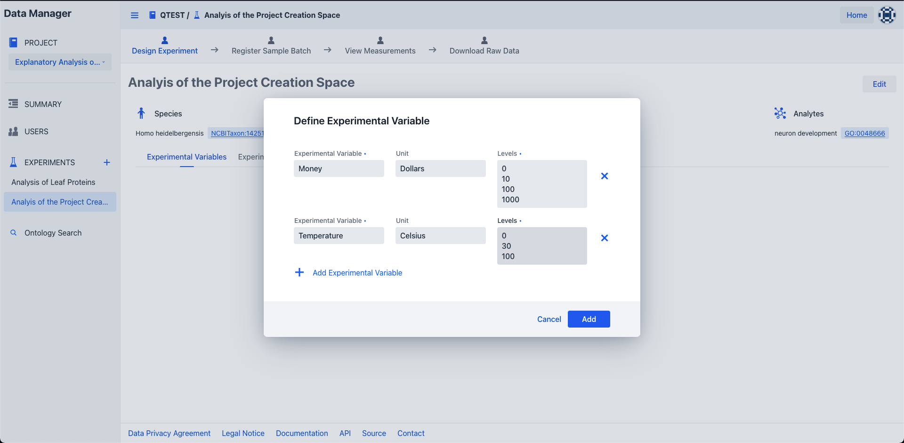
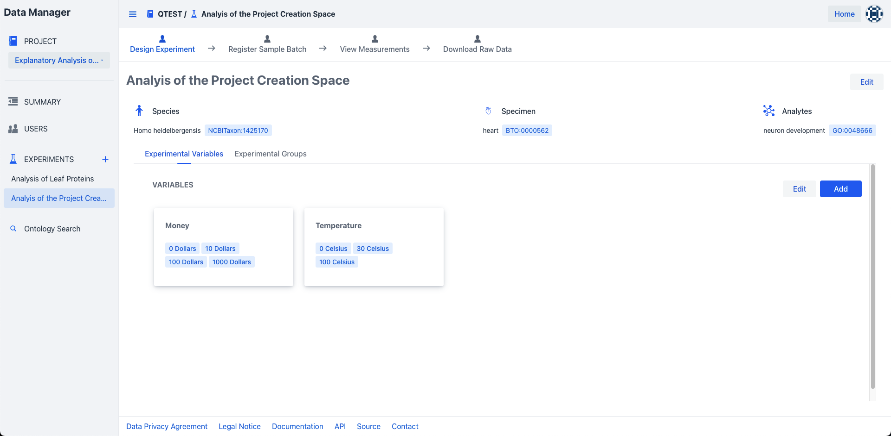
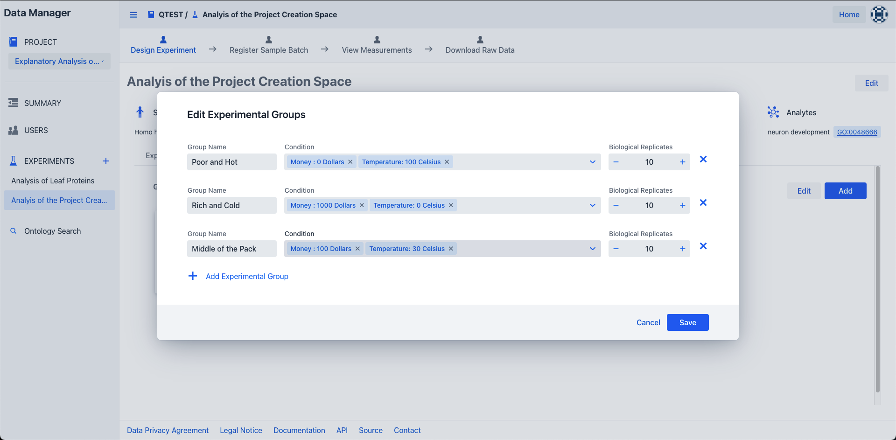
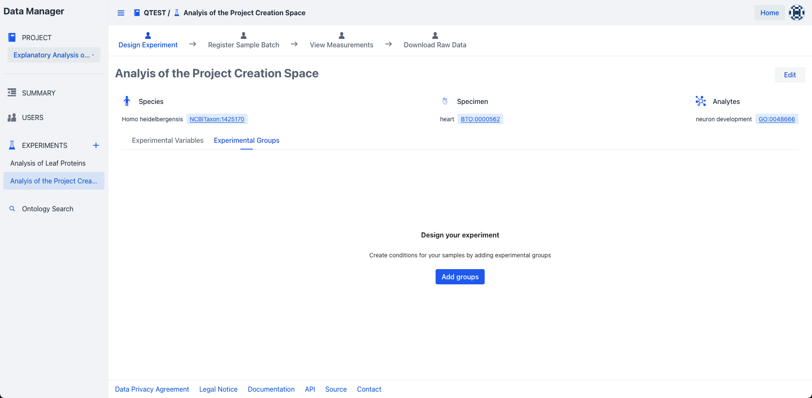
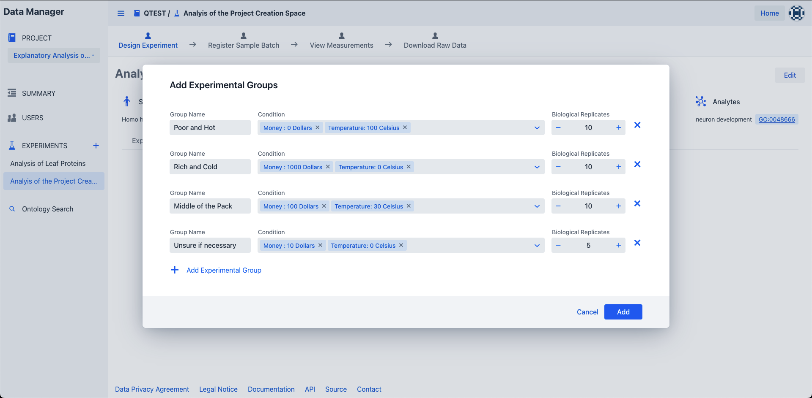
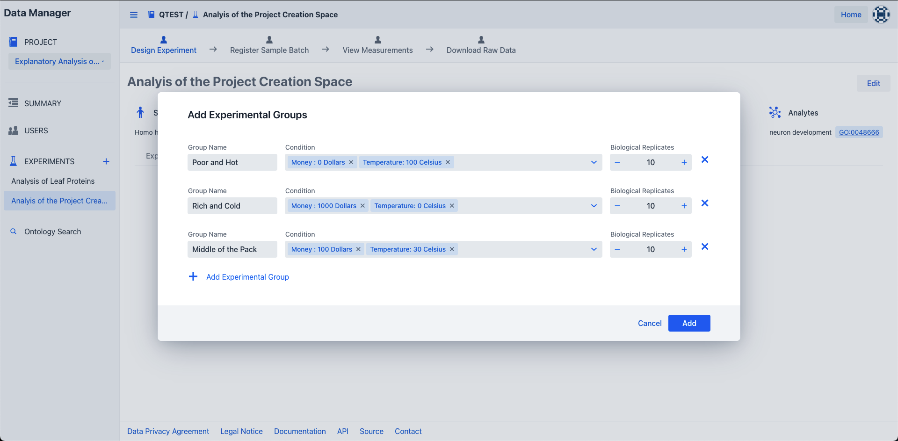
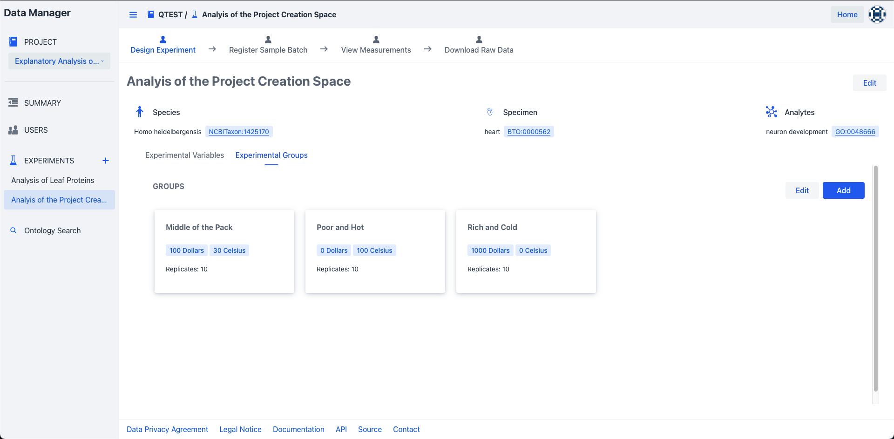

# Experiment Creation

Start by [navigating](../project/project_introduction.md#project-navigation) 
to the project summary view of your project of interest.
To create an experiment in the selected project, click the add button within the experiment component on the top right.

!!! info "Project role"
    Should you not see the add button,
    ensure that you have been granted the "write" or "admin" project role by the project owner/admin!

This will open the create experiment dialog, in which you can specify the name of the experiment and the included species, specimen and analyte
information of the involved organisms.
To provide these details you can select one or more entries via the provided combo boxes.
Start by providing an easily identifiable name and at least 2 letters of your species, specimen or analyte in their respective inputs
fields and possible selection options will appear.

!!! info "Ontology id"
    Behind each selectable option within the species, specimen and analyte input fields
    , the unique ontology identifier from one of several ontologies is stored.

Optionally you can also select one of the provided icons most fitting for your selected species and specimen.

Once all the required information has been provided you can create your experiment via the "Add"
button below.

## Experimental Variable Creation

Experimental variables can be considered as the building blocks for the condition with which the samples in your experiments were treated.  
One or more of these variables can be added in the experiment summary screen by selecting the experimental variables tab and pressing the "add variables" button within the disclaimer.

!!! info "Project role"
    Should you not see the add button,
    ensure that you have been granted the "write" or "admin" project role by the project owner/admin!

Once clicked, the add variables dialog will appear, in which one or more variables can be defined and linked to your experiment.

Defined variables can also be deleted easily via a click on the cross icon next to the variable

Once all variables have been defined, they can be linked to the experiment by clicking the "Add" button within the dialog.

Finally, already defined experimental variables can be edited by clicking on the edit button within the Experimental Variables tab, 
which will open the edit experimental variable dialog in which the necessary changes can be made and saved via a click on the save button. 

## Experimental Group Creation

Experimental groups contain the biological replicates which experienced the same condition defined by its experimental variables within your experiment.  
You can define your samples into distinct groups via a selection of the experimental groups tab within the experiment summary screen. 
In this tab press the "Add groups" button within the disclaimer.

!!! info "Project role"
    Should you not see the add button,
    ensure that you have been granted the "write" or "admin" project role by the project owner/admin!

Once clicked, the add experimental group dialog will appear, in which one or more groups can be defined via a selection of the previously defined experimental variable and linked to your experiment.

Defined groups can also be deleted easily via a click on the cross icon next to the group

Once all variables have been defined, they can be linked to the experiment by clicking the "Add" button within the dialog.

Finally, already defined experimental groups can be edited by clicking on the edit button within the Experimental Groups tab,
which will open the edit experimental groups dialog in which the necessary changes can be made and saved via a click on the save button.

