# Measurement Edit

To edit measurement metadata, start by [navigating](measurement_introduction.md#measurement-navigation) into the measurement summary view.

Once within the measurement summary view, measurements can be edited via the following steps:

1. Select the tab containing the [registered metadata](measurement_registration.md#measurement-registration) of the domain of interest.
2. [Download](#download-metadata) the measurement metadata  
3. [Prepare](#prepare-metadata) the edits of the downloaded domain specific metadata sheet
4. [Upload](#upload-metadata) the edited metadata sheet via the edit measurement dialog

Additionally, within the measurement summary view you're also able to [delete](#delete-metadata) measurement metadata.

!!! info "Project role"
    Should you not see the edit, deletion and download buttons,
    please make sure that you have been granted the "write" or "admin" role to the project by its owner or an admin!

## Download Metadata

### Proteomics

Start by selecting the **Proteomics** Tab within the measurement metadata tab sheet.
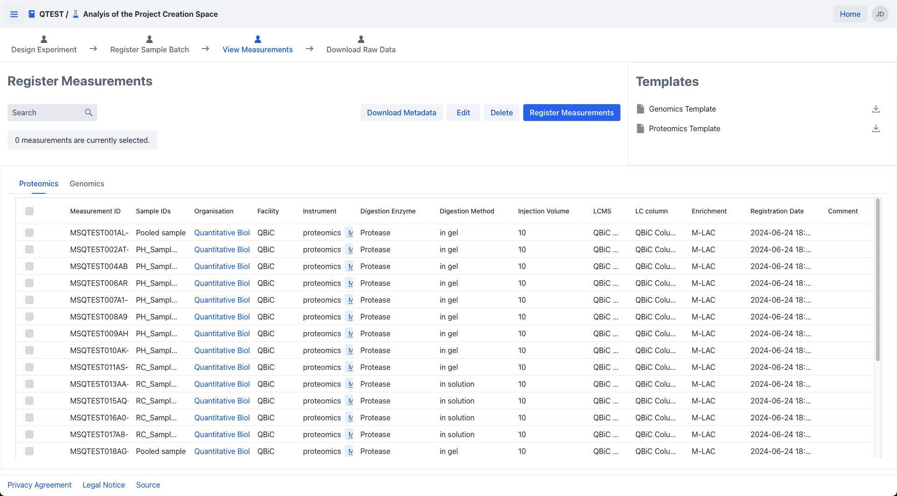

Press the "Download Metadata" button, which will download the metadata for all your proteomic measurements in a _xlsx_ file.

### Genomics

Start by selecting the **Genomics** Tab within the measurement metadata tab sheet.
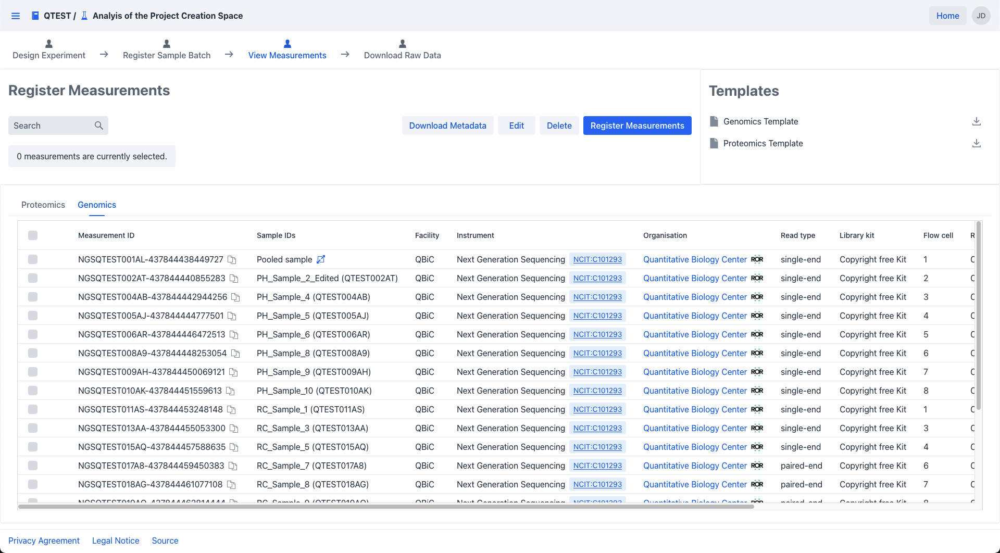

Press the "Download Metadata" button, which will download the metadata for all your genomic measurements in a _xlsx_ file.
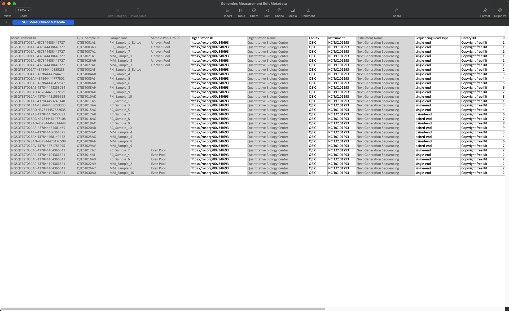

## Prepare Metadata

### Proteomics

Start by opening the downloaded proteomics measurement metadata _xlsx_ file containing the domain specific metadata sheet.

The _xlsx_ lists the registered measurements according to their measurement Ids with the provided property values during the registration.

!!! warning "Fixed Properties"
    Specific measurement properties such as _Measurement Id_ **cannot** be changed after a measurement has been registered.
    Cells of these properties are marked as grey, meaning changes to these cells will be ignored.
    Errors made within these cells require a [deletion](#delete-metadata) and [reregistration](measurement_registration.md#measurement-registration) of the measurement metadata in question. 

Within this sheet make the necessary property changes for the measurements.
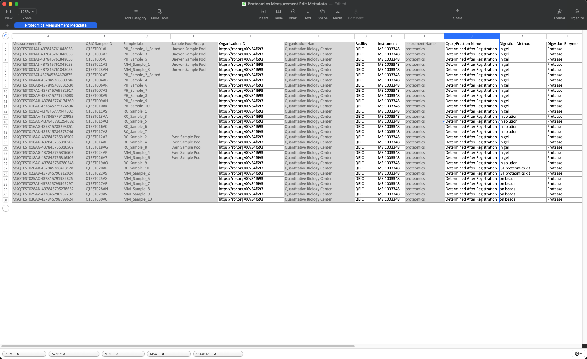

Finally, export the sheet into a tab seperated UTF-16BE Unicode Text (*.txt) text file.
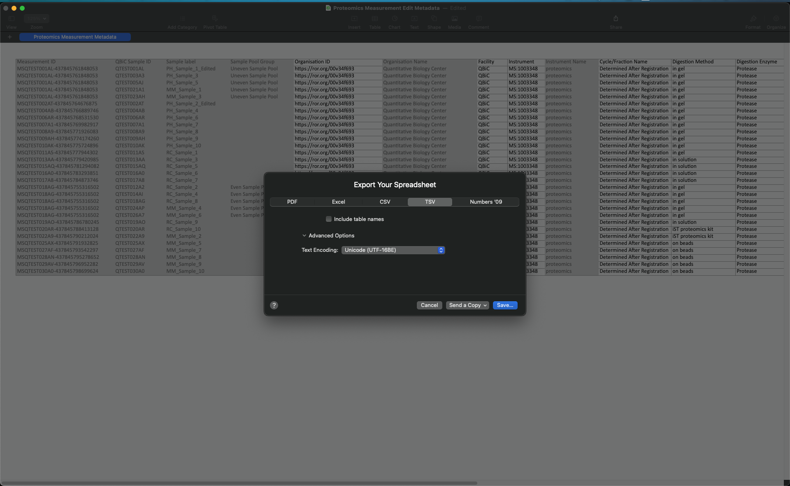

**Notes:**
The "Instrument" column expects an ontology [CURIE](https://link.springer.com/article/10.1007/s12599-022-00744-0) of the instrument.
You can use our [ontology search](../ontology_search/ontology_search_introduction.md#ontology-search) to find the CURIE

The "Organisation Id" column expects the full [RoR Id](https://ror.org/about/) URL of the organisation.
Use the [ROR registry search](https://ror.org/search) to determine the URL of the organisation RoR Id.

Finally, [upload](#upload-metadata) the exported text file into the data manager application.

### Genomics

Start by opening the downloaded proteomics measurement metadata _xlsx_ file containing the domain specific metadata sheet.

The _xlsx_ file lists the registered measurements according to their measurement Ids with the provided property values during the registration.

!!! warning "Fixed Properties"
    Specific measurement properties such as _Measurement Id_ **cannot** be changed after a measurement has been registered.
    Cells of these properties are marked as grey, meaning changes to these cells will be ignored.
    Errors made within these cells require a [deletion](#delete-metadata) and [reregistration](measurement_registration.md#measurement-registration) of the measurement metadata in question.

Within this sheet make the necessary property changes for the measurements.
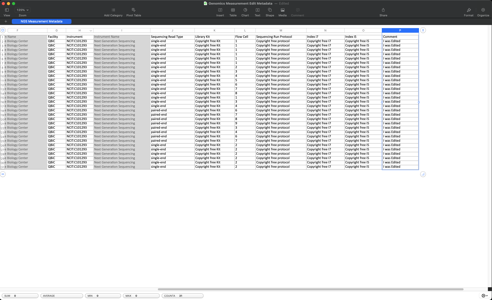

Finally, export the sheet into a tab seperated UTF-16BE Unicode Text (*.txt) text file.
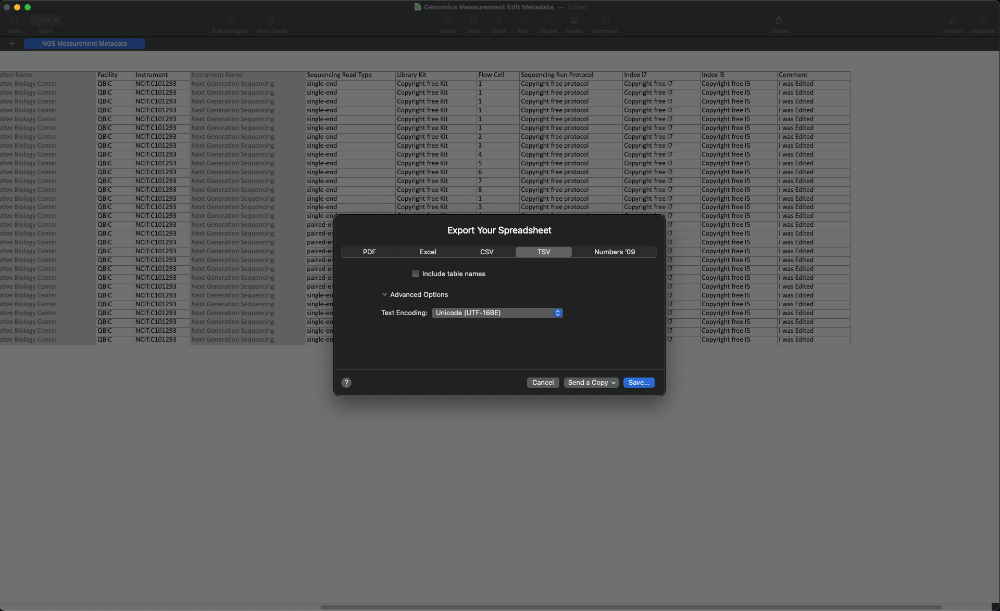

**Notes:**
The "Instrument" column expects an ontology [CURIE](https://link.springer.com/article/10.1007/s12599-022-00744-0) of the instrument.
You can use our [ontology search](../ontology_search/ontology_search_introduction.md#ontology-search) to find the CURIE

The "Organisation Id" column expects the full [RoR Id](https://ror.org/about/) URL of the organisation.
Use the [ROR registry search](https://ror.org/search) to determine the URL of the organisation RoR Id.

Finally, [upload](#upload-metadata) the exported text file into the data manager application.

## Upload Metadata

Once the measurement metadata has been [prepared](#prepare-metadata) according to the domain specifications,
the exported _txt_ file can be uploaded into the data manager application.

To start the update process press the "Edit" button within the measurement summary view.

This will open the measurement edit dialog with which the edited metadata can be uploaded.
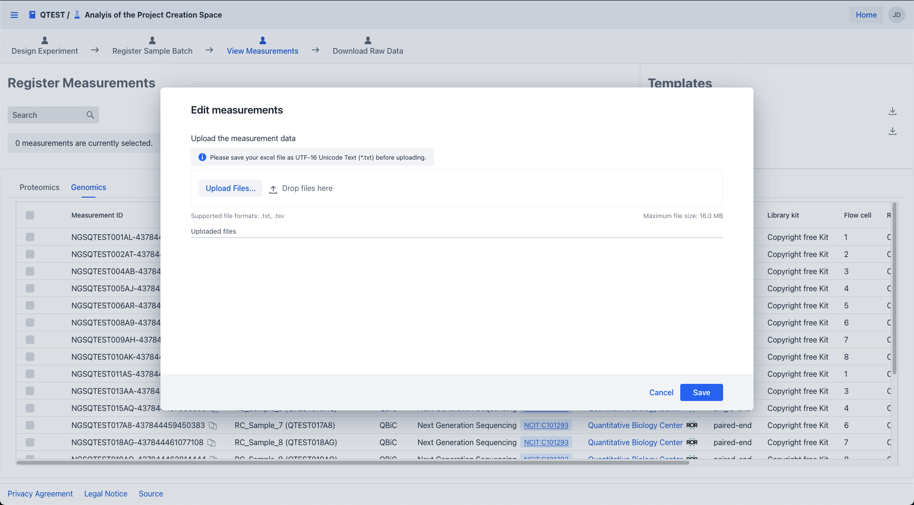
Within the dialog you are able to upload your measurement files either via clicking the upload files button and selecting the files of interest in your file system
or by drag and dropping the files into the dashed box saying "drop your files here".
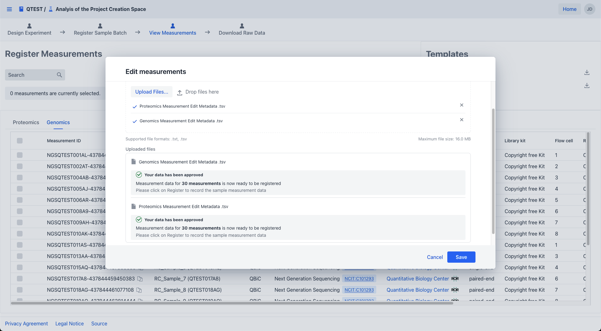

Should you have uploaded one or more files by accident, you can easily delete them via a press of the cross icon next to their respective file names

!!! warning "File constraints"
    Please adhere to the file format and maximum file size outlined in the dialog.
    Currently, we support the _txt_ or _tsv_ file formats with a maximum file size of 16Mb

The edit dialog will validate the provided metadata information and show invalid properties below the file name.

Once all metadata properties are valid, upload the measurement metadata files to the experiment via pressing the "Save" button on the bottom right of the dialog.
The changed measurement metadata will be shown in the grid within their domain specific tab in the measurement summary view.

# Delete Metadata

To delete measurement metadata, start by [navigating](measurement_introduction.md#measurement-navigation) into the measurement summary view.

Once within the measurement summary view, start the measurement metadata deletion process by selecting the measurements within the domain of interest.
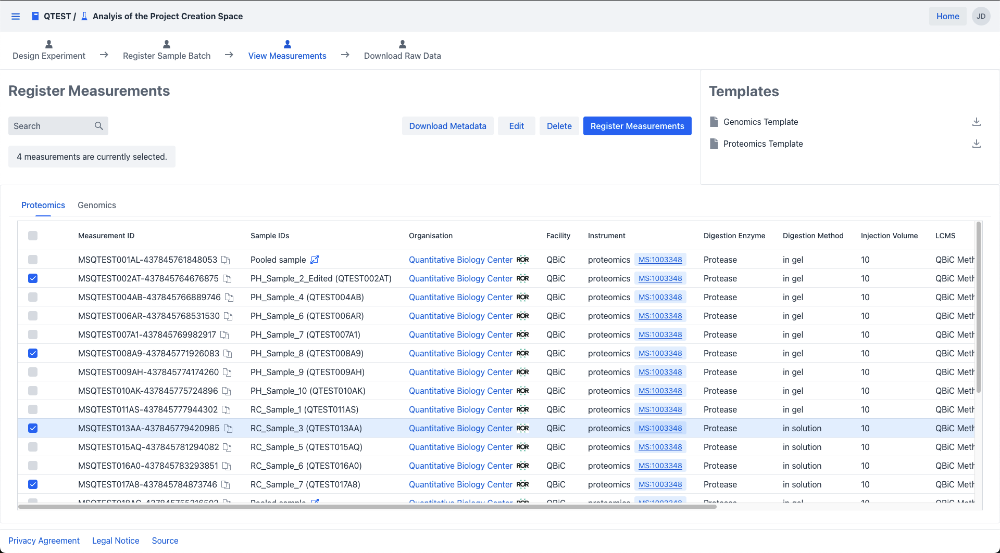

Alternatively, can also select all measurements of a domain via a press of the checkbox within the column header. 
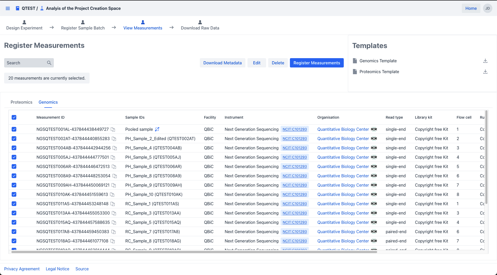

You are also able to use the Search field above to filter measurements before selection. Keep in mind that changing the filter will reset the selection of measurements.

!!! Note "Domain Specific Selection"
    The selected measurements are reset if a different domain tab is clicked.
    Therefore, delete the measurements for each domain individually.

Afterwards, press the "Delete" button to start the measurement deletion. A dialog will open asking you to confirm the deletion and informing you about the number and domain of the measurements that will be deleted.
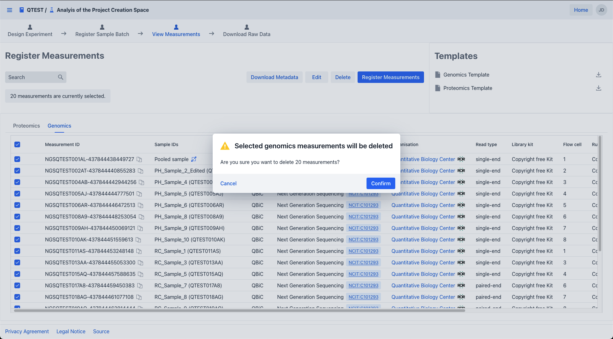

Press the "Confirm" button to trigger the measurement deletion. 
If all measurements for a specific domain have been deleted, the domain specific tab will disappear as well until new measurements are registered.

!!! warning "Attached Raw Data"
    Keep in mind, that measurements can only be deleted if they have no raw data attached to them. 
    Otherwise, you need to delete the raw data before the measurement can be deleted.
