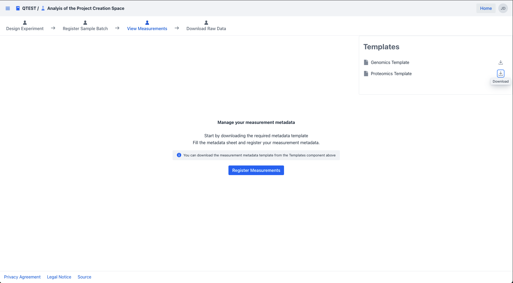
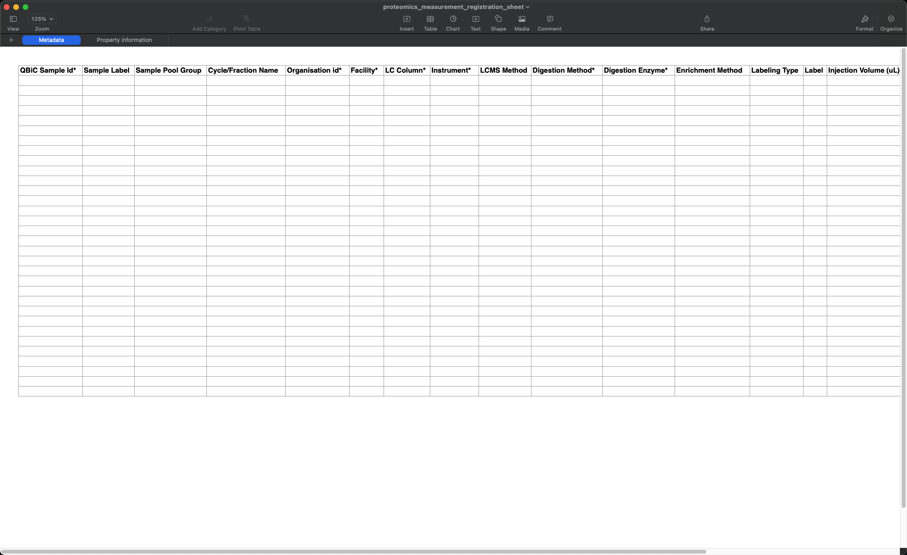
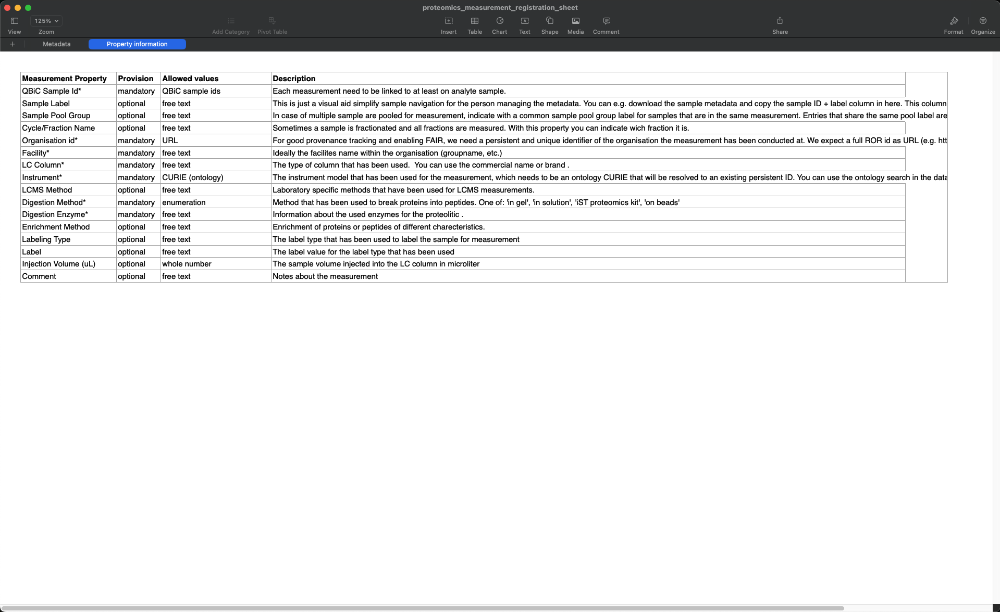
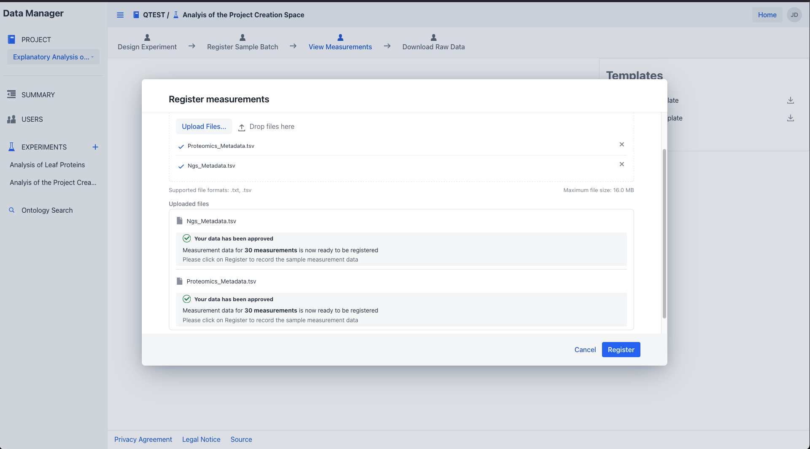
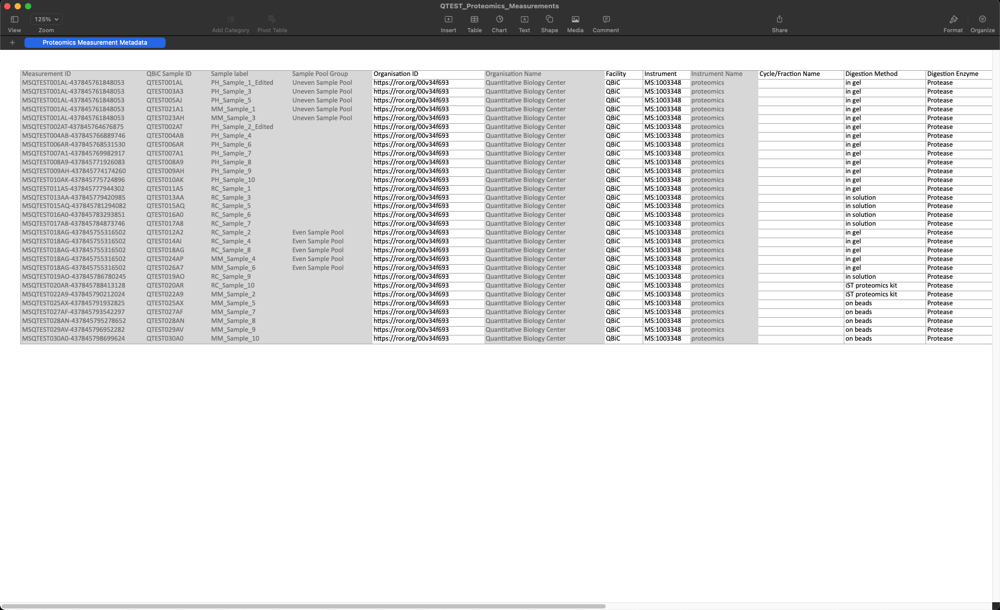

# Measurement Registration

To register measurements, start by [navigating](measurement_introduction.md#measurement-navigation) into the measurement summary view.

Once within the measurement summary view, measurements can be registered via the following steps:

1. [Download](#download-template) the domain specific metadata template spreadsheet
2. [Prepare](#prepare-metadata) the downloaded metadata sheet with the domain specific mandatory information
3. [Upload](#measurement-upload) the filled in measurement metadata sheet

!!! info "Project role"
    Should you not see the registration and download buttons,
    please make sure that you have been granted the "write" or "admin" role to the project by the owner/admin!

## Download Template

### Proteomics

Within this view download the proteomic specific template's _.xlsx_ file via the template component on the top right by clicking
on the download icon (down arrow).

### Genomics

Within this view download the genomic specific templates xlsx file via the template component on the top right by clicking
on the download icon(down arrow).

Once downloaded open the template file in Microsoft Excel, which contains the two sheets "Property Information" and "Metadata".

## Prepare Metadata

### Proteomics

Start by opening the downloaded proteomics template file in Microsoft Excel, which contains the two sheets "Property Information" and "Metadata".

The "Property Information" Sheet provides detailed information about which properties are required and what values are permitted for each property within the sheet.

Use these Guidelines to fill in the "Metadata" sheet with the mandatory necessary information for the performed measurement.

!!! tip "Sample Id"
    You can copy the Sample ID from the [downloadable](../batch/batch_registration.md#batch-metadata-download) batch metadata sheet

**Notes:**
Mandatory metadata properties are marked with an asterisk next to the column header

The "Instrument" column expects an ontology [CURIE](https://link.springer.com/article/10.1007/s12599-022-00744-0) of the instrument.
You can use our [ontology search](../ontology_search/ontology_search_introduction.md#ontology-search) to find the CURIE

The "Organisation Id" column expects the full [RoR Id](https://ror.org/about/) URL of the organisation.
Use the [ROR registry search](https://ror.org/search) to determine the URL of the organisation RoR Id.

Once the mandatory measurement metadata has been provided, export "Metadata" sheet into a tab seperated UTF-16BE Unicode Text (*.txt) text file. 

Finally, [upload](#measurement-upload) the exported text file into the data manager application.

### Genomics

Start by opening the downloaded genomic template file in Microsoft Excel, which contains the two sheets "Property Information" and "Metadata".

The "Property Information" Sheet provides detailed information about which properties are required and what values are permitted for each property within the sheet.

Use these Guidelines to fill in the "Metadata" sheet with the mandatory necessary information for the performed measurement.

!!! tip "Sample Id"
    You can copy the Sample ID from the [downloadable](../batch/batch_registration.md#batch-metadata-download) batch metadata sheet

**Notes:**
Mandatory metadata properties are marked with an asterisk next to the column header

The "Instrument" column expects an ontology [CURIE](https://link.springer.com/article/10.1007/s12599-022-00744-0) of the instrument.
You can use our [ontology search](../ontology_search/ontology_search_introduction.md#ontology-search) to find the CURIE

The "Organisation Id" column expects the full [RoR Id](https://ror.org/about/) URL of the organisation.
Use the [ROR registry search](https://ror.org/search) to determine the URL of the organisation RoR Id.

Once the mandatory measurement metadata has been provided, export "Metadata" sheet into a tab seperated UTF-16BE Unicode Text (*.txt) text file.

Finally, [upload](#measurement-upload) the exported text file into the data manager application. 

## Measurement Upload

Once the measurement metadata has been [prepared](#prepare-metadata) according to the domain specifications, 
the exported _txt_ file can be uploaded into the data manager application. 
To start the measurement registration process press the "Register Measurements" button within the measurement summary view. 

This will open the measurement registration dialog with which the metadata can be registered. 

Within the dialog you are able to upload your measurement files either via clicking the upload files button and selecting the files of interest in your file system
or by drag and dropping the files into the dashed box saying "drop your files here".

Should you have uploaded one or more wrong files, you can easily delete them via a press of the cross icon next to their respective file names

!!! warning "File constraints"
    Please adhere to the file format and maximum file size outlined in the dialog.
    Currently, we support the _txt_ or _tsv_ file formats with a maximum file size of 16Mb

The registration dialog will validate the provided information and show invalid properties in below the file name. 

Finally, upload the measurement metadata files to the experiment via pressing the "Register" button on the bottom right of the dialog.

!!! note "Measurement Id"
    During measurement registration each measurement will be assigned a unique measurement ID,
    distinguishing it from other measurement within the system.

Your uploaded measurement metadata will be shown in the grid within their domain specific tab in the measurement summary view.

## Measurement Metadata Download

You can download the measurement specific metadata via the "Download Metadata" button, which will download the metadata of all measurements of the **currently selected tab** in an _xlsx_ file.

